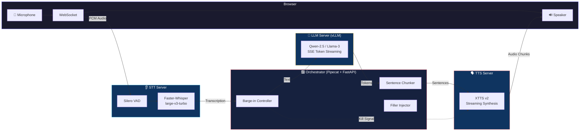

# 🎙️ TBB-VaaniAI

**Ultra-low latency (<300ms) self-hosted real-time voice AI agent for Hindi/Hinglish.**

VaaniAI sounds completely human, supports barge-in (interruption), and outperforms commercial APIs in regional Indian languages. Built on a fully streaming, component-based architecture where no component waits for the previous one to finish.

---

## 🏗️ Architecture



### The 4-Pillar Streaming Architecture

| Pillar | Component | Role | Latency Target |
|--------|-----------|------|----------------|
| 👂 Ears | Silero VAD + Faster-Whisper | Detect speech (10-20ms), transcribe in 200ms chunks | <250ms |
| 🧠 Brain | vLLM (Qwen-2.5 / Llama-3) | Generate response tokens via SSE streaming | First token <100ms |
| 🗣️ Voice | XTTS v2 | Synthesize speech from partial sentences | First chunk <200ms |
| 🎛️ Glue | FastAPI + Pipecat | Route audio/text streams, handle barge-in | <10ms overhead |

### The "Sub-300ms Latency" Playbook

1. **Filler Words**: LLM starts every response with "Hmm...", "Ji...", etc. — TTS plays this in 50ms while the LLM thinks.
2. **Sentence Chunking**: Tokens are batched at punctuation marks before sending to TTS — not word-by-word, not full paragraphs.
3. **KV-Cache Pre-warming**: vLLM caches the system prompt, eliminating re-processing for each call.

---

## 🚀 Quick Start

### Prerequisites

- **NVIDIA GPU** with CUDA support (RTX 4090 / A40 recommended)
- **Docker** with [NVIDIA Container Toolkit](https://docs.nvidia.com/datacenter/cloud-native/container-toolkit/install-guide.html)
- **vLLM server** running separately (or any OpenAI-compatible endpoint)

### 1. Clone & Configure

```bash
git clone <repo-url> vaani-ai
cd vaani-ai
cp .env.example .env
# Edit .env with your vLLM endpoint and preferences
```

### 2. Start vLLM (if not already running)

```bash
# On your LLM server (Server A)
pip install vllm
vllm serve Qwen/Qwen2.5-7B-Instruct --host 0.0.0.0 --port 8000
```

### 3. Launch VaaniAI

```bash
# Using the setup script (recommended)
chmod +x scripts/setup.sh
./scripts/setup.sh

# Or manually with Docker Compose
docker compose up --build
```

### 4. Open the Demo

Navigate to **http://localhost:8080** in your browser. Click the voice orb and start speaking in Hindi or Hinglish.

---

## ⚙️ Configuration

All configuration is done via environment variables in `.env`. See [.env.example](.env.example) for the full reference.

### Key Settings

| Variable | Default | Description |
|----------|---------|-------------|
| `VLLM_BASE_URL` | `http://localhost:8000/v1` | vLLM API endpoint |
| `VLLM_MODEL` | `Qwen/Qwen2.5-7B-Instruct` | Model to use for chat |
| `WHISPER_MODEL` | `large-v3-turbo` | Faster-Whisper model size |
| `WHISPER_LANGUAGE` | `hi` | Primary language for STT |
| `XTTS_VOICE` | `vaani_default.wav` | Reference voice for cloning |
| `VAD_THRESHOLD` | `0.5` | Voice detection sensitivity |

---

## 🛠️ Development

### Running Without Docker

```bash
# Terminal 1: STT Server
cd stt-server && pip install -r requirements.txt
python server.py

# Terminal 2: TTS Server
cd tts-server && pip install -r requirements.txt
python server.py

# Terminal 3: Orchestrator
cd orchestrator && pip install -r requirements.txt
python main.py
```

### Project Structure

```
vaani-ai/
├── docker-compose.yml          # Service orchestration
├── .env.example                # Configuration template
├── orchestrator/               # 🎛️ FastAPI + Pipecat pipeline
│   ├── main.py                 # WebSocket server
│   ├── pipeline.py             # Streaming pipeline assembly
│   ├── config.py               # Centralized config
│   ├── services/               # STT, LLM, TTS, VAD wrappers
│   └── processors/             # Sentence chunker, barge-in, filler
├── stt-server/                 # 👂 Faster-Whisper + Silero VAD
├── tts-server/                 # 🗣️ XTTS v2 streaming
├── frontend/                   # 🌐 Browser demo UI
└── scripts/                    # Setup & benchmark tools
```

---

## 📊 Benchmarking

```bash
chmod +x scripts/benchmark.sh
./scripts/benchmark.sh --test-e2e
```

The benchmark measures:
- **Time-to-First-Audio (TTFA)**: From end of user speech to first AI audio chunk
- **STT Latency**: Audio → Transcription
- **LLM TTFT**: Prompt → First Token
- **TTS TTFC**: Text → First Audio Chunk

---

## 🗺️ Roadmap

- [ ] Telephony integration (FreeSWITCH / SIP)
- [ ] MeloTTS alternative backend (ultra-fast, lightweight)
- [ ] Parler-TTS for expressive/emotional voices
- [ ] Multi-turn memory with RAG
- [ ] Load balancing for 1000+ concurrent calls
- [ ] Voice persona marketplace

---

## 📄 License

This project is for internal use. Note that XTTS v2 uses the Coqui Public Model License (CPML) — verify compliance for your use case.
